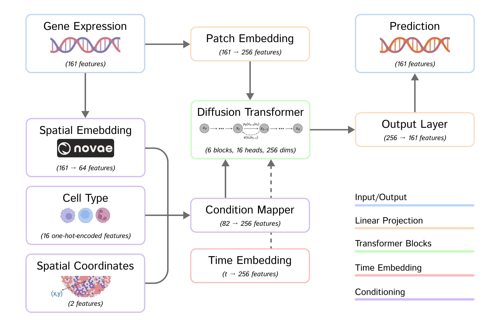

# SpatialDiT: 3D Tissue Reconstruction from Sparse Spatial Transcriptomics Data via Diffusion-Based Interpolation

## Overview

This repository contains a modular implementation of a Diffusion Transformer (DiT) model for spatial transcriptomics data. The model uses diffusion processes to generate gene expression profiles conditioned on spatial coordinates, cell types, and learned embeddings. 

This project was developed as part of the CS 283: Deep Generative Modeling course at King Abdullah University of Science and Technology (KAUST) by Abdel Rahman Alsabbagh and Mahmoud Zahran, under the supervision of Professor Mohamed Elhoseiny.

The model architecture is flexible, supporting different types of conditioning blocks:
- Adaptive Layer Normalization (adaLN)
- Cross-attention
- In-context conditioning

## Features

- Conditional diffusion model for spatial transcriptomics data
- Multiple conditioning mechanisms for integrating spatial information and cell type
- Leave-one-out cross-validation for evaluating spatial generalization
- Evaluation metrics including cosine similarity and Pearson correlation
- Batch processing for large-scale datasets
- Weights & Biases integration for experiment tracking




## Installation

```bash
# Clone the repository
git clone https://github.com/username/spatial-transcriptomics-diffusion.git
cd spatial-transcriptomics-diffusion

# Create a conda environment
conda create -n st-dit python=3.9
conda activate st-dit

# Install dependencies
pip install torch scanpy anndata numpy matplotlib wandb
```

## Dataset

The model is designed to work with spatial transcriptomics data in AnnData format. You need:

1. A primary AnnData object from [Squidpy](https://squidpy.readthedocs.io/en/stable/) containing gene expression data and spatial metadata with:
   - `obs["Bregma"]`: Slice information
   - `obs["Centroid_X"]`, `obs["Centroid_Y"]`: Spatial coordinates
   - `obs["Cell_class"]` or `obs["Neuron_cluster_ID"]`: Cell type information

2. A companion AnnData object with precomputed spatial transcriptomics embeddings from [Novae](https://mics-lab.github.io/novae/).

## Code Structure

```
spatial_transcriptomics_diffusion/
├── data/
│   └── dataset.py             # Dataset loading and processing
├── models/
│   ├── __init__.py            # Model component imports
│   ├── blocks.py              # Transformer block implementations
│   ├── conditional_dit.py     # Main DiT model architecture
│   ├── embedders.py           # Time step and condition embedders
│   └── scheduler.py           # Noise scheduler for diffusion
├── utils/
│   ├── __init__.py            # Utility function imports
│   ├── diffusion.py           # Diffusion process functions
│   └── evaluation.py          # Evaluation metrics and procedures
├── train.py                   # Training functionality
└── main.py                    # Main entry point with CLI
```

## Usage

### Basic Usage

```bash
python main.py --data_path=merfish_all-slices.h5ad --embeddings_path=merfish_novae_embeding.h5ad --block_type=adaLN --hidden_size=256 --num_layers=6 --num_heads=16
```

### Leave-One-Out Cross-Validation

```bash
python main.py --data_path=merfish_all-slices.h5ad --embeddings_path=merfish_novae_embeding.h5ad --block_type=adaLN --hidden_size=256 --num_layers=6 --num_heads=16 --leave_one_out --wandb_project=ST-DiT-Experiment
```

### Single Test Slice

```bash
python main.py --data_path=merfish_all-slices.h5ad --embeddings_path=merfish_novae_embeding.h5ad --block_type=adaLN --test_slice=-29
```

### Parameter Options

```
--data_path          Path to main AnnData file
--embeddings_path    Path to ST embeddings AnnData file
--block_type         Type of attention block to use (adaLN, cross_attention, in_context)
--hidden_size        Dimension of hidden layers
--num_layers         Number of transformer layers
--num_heads          Number of attention heads
--add_variance       Whether to add variance in reverse diffusion
--batch_size         Batch size for training
--epochs             Number of epochs to train
--lr                 Learning rate
--timesteps          Number of diffusion timesteps
--patience           Early stopping patience
--leave_one_out      Run leave-one-out cross validation
--test_slice         Specific slice to use as test set
--wandb_project      Weights & Biases project name
--seed               Random seed
--device             Device to use (cuda, cpu)
--save_dir           Directory to save results
```


